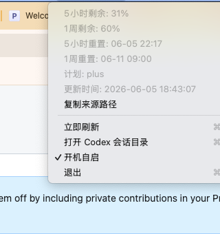

# CodexBar

CodexBar 是一个简约的 macOS **状态栏应用**，用于在菜单栏里显示 Codex 当前的剩余用量。

它聚焦两个最常用的窗口：

- `5 小时` 剩余用量
- `1 周` 剩余用量

同时也提供：

- 两个窗口的重置时间
- 当前计划类型
- 最近一次更新时间
- 快照来源路径
- `开机自启` 开关

## 截图

状态栏展示：


下拉菜单：



## 下载

最新发布版本：

- [v0.1.6](https://github.com/l445698714/codexbar/releases/tag/v0.1.6)

发布附件：

- [CodexBar-v0.1.6-macos.zip](https://github.com/l445698714/codexbar/releases/download/v0.1.6/CodexBar-v0.1.6-macos.zip)

## 适用环境

- macOS `13.0+`
- 已安装并使用 Codex 桌面端
- 当前用户目录下存在 Codex 本地数据目录 `~/.codex`

## 工作原理

CodexBar 会优先读取当前登录态下可访问的用量接口，并把最近一次可用的配额状态显示到状态栏。

当接口不可用或本地无法读取访问令牌时，它会回退到本机落盘数据。

当前实现会组合三类数据来源：

- `https://chatgpt.com/backend-api/wham/usage`
- `~/.codex/sessions`
- `~/.codex/logs_2.sqlite`

刷新策略分为两层：

- 文件变化后立即刷新
- 固定周期刷新，并在 Codex 事件后追加几次延迟复查

这样做的目标是尽量接近 Codex UI 的剩余用量，同时在网络或登录态不可用时仍保持可用。

## 功能特性

- 菜单栏实时显示 `5小时剩余 · 1周剩余`
- 下拉菜单显示重置时间、计划、更新时间和来源
- 支持 `立即刷新`
- 支持打开 Codex 会话目录
- 支持菜单内开关 `开机自启`
- 优先通过登录态接口同步最新用量，本地快照作为回退
- 当窗口超过重置时间但没有新快照时，会按重置时间推导窗口已回满

## 安装使用

1. 从 [Release](https://github.com/l445698714/codexbar/releases/tag/v0.1.6) 下载 `CodexBar-v0.1.6-macos.zip`
2. 解压后得到 `CodexBar.app`
3. 打开应用，状态栏会出现剩余用量
4. 点击状态栏图标，可查看详情或开启 `开机自启`

首次启用开机自启时，macOS 可能要求你在系统设置里确认登录项权限。

## 本地构建

源码入口：

- `src/main.m`
- `Support/Info.plist`

编译：

```bash
mkdir -p build
clang -fobjc-arc -fmodules -framework Cocoa -framework ServiceManagement -lsqlite3 -mmacosx-version-min=13.0 -o build/CodexBar src/main.m
```

生成 `.app`：

```bash
mkdir -p dist/CodexBar.app/Contents/MacOS dist/CodexBar.app/Contents/Resources
cp build/CodexBar dist/CodexBar.app/Contents/MacOS/CodexBar
cp Support/Info.plist dist/CodexBar.app/Contents/Info.plist
codesign --force --deep --sign - dist/CodexBar.app
```

命令行查看当前快照：

```bash
./build/CodexBar --snapshot
```

## 项目结构

- `src/main.m`
  单文件原生 AppKit 实现，包含状态栏 UI、配额解析、文件监听和刷新调度
- `Support/Info.plist`
  应用元数据
- `assets/images/`
  README 截图资源

## 已知限制

- 当前不是直接订阅 Codex 内存态，而是基于接口响应和本地持久化数据推导
- 当 Codex 上游改动本地数据格式时，读取逻辑可能需要跟进调整
- 当上游接口结构、登录态文件或鉴权方式变化时，接口读取逻辑也可能需要跟进调整
- 某些时刻可能仍会比 Codex UI 晚一个本地事件落盘周期

## 隐私说明

CodexBar 本身不单独维护登录流程。它会优先复用当前用户本机 `~/.codex/auth.json` 中已有的登录态访问用量接口，并在需要时读取本地 `~/.codex` 数据文件作为回退。

除用量同步接口外，它不会额外请求其他第三方网络服务。

## Contributing

欢迎提交 issue 和 pull request。

在提交改动前，建议至少完成这几步：

1. 本地重新编译 `CodexBar`
2. 用 `./build/CodexBar --snapshot` 检查快照读取是否正常
3. 手动确认状态栏展示、下拉菜单和 `开机自启` 开关没有回归

## Roadmap

- 更稳定的本地事件源识别与去重
- 更明确的刷新状态展示
- 更清晰地区分 API 来源与本地回退来源
- 菜单内的诊断信息与调试入口

## License

本项目使用 [MIT License](LICENSE)。
